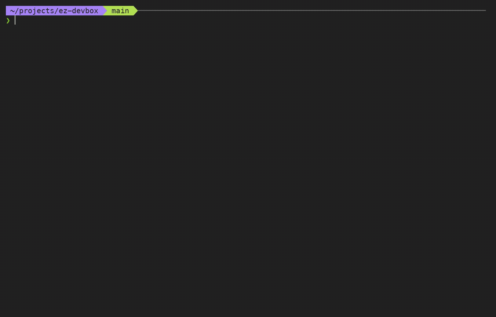

# 🤖 ez-devbox 📦

[](https://www.npmjs.com/package/ez-devbox)
[](https://github.com/shanebishop1/ez-devbox/actions/workflows/ci.yml)
[](https://github.com/shanebishop1/ez-devbox/blob/main/LICENSE)

`ez-devbox` runs coding agents in disposable [E2B](https://e2b.dev) sandboxes. It clones your repos, syncs selected tool config and credentials, and lets you reconnect to persistent sessions.



## Features

- Launch and reconnect to OpenCode, Codex, Claude Code, or a shell in the same sandbox.
- Clone repos, check out branches, and run setup commands from a TOML config.
- Forward selected environment variables and sync local tool auth/config.
- Reach local MCP servers, Docker containers, or other services through optional tunnels.

## Demo flow

After the [Quick start](#quick-start), with Node.js 20+, an `E2B_API_KEY` in `.env`, and an `ez-devbox.config.toml` in the current directory:

```bash
npx ez-devbox@latest create --mode ssh-opencode --detach --json
# Set SANDBOX_ID to the sandboxId from the create result.
npx ez-devbox@latest resume
npx ez-devbox@latest list --json
npx ez-devbox@latest wipe --sandbox-id "$SANDBOX_ID"
```

## Agent Modes

- `ssh-opencode`: SSH into the sandbox and attach the OpenCode TUI to a persistent in-sandbox `opencode serve` backend.
- `ssh-codex`: SSH into the sandbox and attach Codex inside a persistent `tmux` session.
- `ssh-claude`: SSH into the sandbox and attach Claude Code inside a persistent `tmux` session.
- `web`: start `opencode serve` and print the URL.
- `ssh-shell`: SSH into an interactive shell inside a persistent `tmux` session.

Web mode requires a nonempty `OPENCODE_SERVER_PASSWORD` when it starts a new public listener. See [the web mode guide](docs/modes-web.md) for reuse and recovery behavior.

## Install

Prerequisites:

- Node.js 20 or newer on macOS or Linux. Windows config paths are supported, but Windows host SSH/tunnel workflows are not currently tested in CI.
- An [E2B API key](https://e2b.dev/docs/getting-started/api-key).
- `ssh` for SSH modes. If `tmux` is missing in the E2B template, ez-devbox installs it with `apt-get` or `apk`; other templates must provide it. Docker or `cloudflared` is needed only for tunnel features.
- An `ez-devbox.config.toml`, created during onboarding below or by the interactive first-run prompt.

Choose one:

```bash
npm install --save-dev ez-devbox
npx ez-devbox --help
```

or one-off run without install:

```bash
npx ez-devbox --help
```

or global install:

```bash
npm install -g ez-devbox
ez-devbox --help
```

The package installs both `ez-devbox` and its shorter alias, `ezdb`.

## Environment variables

You can set variables in your shell or put them in a local `.env` file.

For a source checkout, copy the template:

```bash
cp .env.example .env
```

Minimum required:

- `E2B_API_KEY`: required for any real sandbox operation (`create`, `connect`, `list`, `wipe`, live e2e).

Common optional vars:

- `FIRECRAWL_API_URL`: used by your own tooling/workloads inside the sandbox (for example tunneled MCP/API endpoints).
- `FIRECRAWL_API_KEY`: forwarded only if configured through `env.pass_through`.
- `GITHUB_TOKEN` / `GH_TOKEN`: used for GitHub auth flows (especially when `[gh].enabled = true`).
- `OPENCODE_SERVER_PASSWORD`: required before `web` mode starts a new public listener; an already-running listener is reused only when it responds with an authentication challenge.

The npm package also ships `.env.example`. Do not commit `.env`; it contains local secrets.

## Quick start

1. Make a project directory, then create `.env` and set at least:

```bash
printf 'E2B_API_KEY=%s\n' 'your_key_here' > .env
```

2. Download the complete minimal config, then edit its repo URL, branch, and setup command:

```bash
curl -fsSLo ez-devbox.config.toml \
  https://raw.githubusercontent.com/shanebishop1/ez-devbox/main/examples/minimal/ez-devbox.config.toml
```

The same example is shipped inside an installed package at `node_modules/ez-devbox/examples/minimal/ez-devbox.config.toml`. See the [minimal workflow](https://github.com/shanebishop1/ez-devbox/tree/main/examples/minimal) for a runnable public-repo example.

Config lookup order:

- Local: `./ez-devbox.config.toml` (from the directory where you run `ez-devbox`)
- Global: user config file
  - macOS/Linux: `~/.config/ez-devbox/ez-devbox.config.toml`
  - Windows: `%APPDATA%\\ez-devbox\\ez-devbox.config.toml`

If neither file exists and you're in an interactive terminal, ez-devbox prompts you to create a starter config locally or globally, then continues with it. In non-interactive environments, it exits with an error listing both expected paths.

If you prefer not to download a file, this is the smallest useful custom-project config:

```bash
cat > ez-devbox.config.toml <<'EOF'
[sandbox]
template = "opencode"
name = "ez-devbox"

[project]
mode = "single"
active = "prompt"

[[project.repos]]
name = "your-repo"
url = "https://github.com/your-org/your-repo.git"
setup_command = "npm install"
EOF
```

Then set each repo's `setup_command` as needed. For every field, see the [config reference](https://github.com/shanebishop1/ez-devbox/blob/main/docs/launcher-config-reference.md).

3. Run commands (`npx` if not globally installed):

```bash
npx ez-devbox create
npx ez-devbox connect
```

## Mode guides

- [Web mode (OpenCode in browser)](https://github.com/shanebishop1/ez-devbox/blob/main/docs/modes-web.md)
- [SSH agent modes (OpenCode, Codex, and Claude Code)](https://github.com/shanebishop1/ez-devbox/blob/main/docs/modes-ssh-agents.md)

## Common commands

Use `npx ez-devbox ...` if the CLI is not globally installed.

| Goal | Command |
| --- | --- |
| Help | `ez-devbox --help` |
| Create sandbox + launch mode | `ez-devbox create --mode web` |
| List sandboxes | `ez-devbox list` |
| Connect to existing sandbox | `ez-devbox connect --sandbox-id <sandbox-id>` |
| Resume last sandbox/mode | `ez-devbox resume` |
| Run command in sandbox | `ez-devbox command --sandbox-id <sandbox-id> -- pwd` |
| JSON output for automation | `ez-devbox list --json` |
| Start agent detached | `ez-devbox create --mode ssh-codex --detach --json` |
| Send follow-up from file | `ez-devbox connect --sandbox-id <id> --mode ssh-codex --detach --prompt-file follow-up.md --json` |
| Wipe one sandbox | `ez-devbox wipe` |
| Wipe all sandboxes | `ez-devbox wipe-all --yes` |

## JSON output contracts

Use `--json` for machine-readable output:

- `list`: `{ "sandboxes": [...] }`
- `command`: command result envelope (`sandboxId`, `command`, `cwd`, `stdout`, `stderr`, `exitCode`)
- `create` / `connect`: launch result envelope (mode, command/url when present, workingDirectory, setup summary)

Optional fields are omitted when undefined (for example `url` is absent for SSH modes).

For detached startup, prompt transport, non-PTY inspection, explicit shell execution, and concurrency guidance, see [Agent and automation usage](docs/agent-automation.md).

## Verbose mode

- Use `--verbose` to show detailed operational logs during `create/connect` (startup mode resolution, sandbox lifecycle steps, create-time tooling sync progress, bootstrap progress, SSH/tunnel setup details).
- Interactive pickers/prompts still show as normal.
- Without `--verbose`, ez-devbox keeps output focused on prompts and final command results.

## Config files

- `ez-devbox.config.toml`: ez-devbox behavior (sandbox, startup, project, env pass-through, tooling auth sync, tunnel). Resolved from local-first then global fallback.
- `.env`: secrets and local env values
- last-run state: by default stored at `${TMPDIR}/ez-devbox/last-run/cwd-state/<sha1(cwd)>/.ez-devbox-last-run.json` (legacy `.agent-box-last-run.json` in the current directory is still read only for persisted-data compatibility)
- [Config reference](https://github.com/shanebishop1/ez-devbox/blob/main/docs/launcher-config-reference.md): full `ez-devbox.config.toml` field reference

## Credentials, tunnels, and resource lifecycle

- `E2B_API_KEY` stays on the host and is used by the E2B SDK; it is not one of the sandbox pass-through variables. Values selected by built-in forwarding or `[env].pass_through` are sent into the sandbox during creation and may also be supplied to setup/startup commands on reconnect.
- Tool auth/config sync is explicit and create-time only. Configured OpenCode, Codex, Claude, and optional GitHub CLI files are copied from the host into the sandbox; treat the sandbox as credential-bearing and use only trusted templates and repositories.
- Cloudflare quick tunnels provide public HTTPS URLs, not private, sandbox-only access. Their URLs are temporary bearer links: anyone with a URL can reach the forwarded service while the host CLI operation and tunnel process remain active. ez-devbox does not configure Cloudflare Access or add authentication; any authentication must be enforced by the upstream service. Treat URLs as secrets, keep them out of shared logs/screenshots, and never expose an unauthenticated sensitive or administrative service.
- Sandboxes are disposable but not automatically deleted when you detach or exit. `sandbox.timeout_ms` sets the E2B timeout at creation; reconnecting does not reset it, and the reserved `reuse` and `delete_on_exit` fields do not currently alter lifecycle behavior.
- Use `wipe --sandbox-id <id>` or `wipe-all --yes` to delete E2B resources explicitly. A newly created sandbox is auto-wiped only when interactive repository selection is cancelled after creation.

### Tunnel targets

For non-local upstream services, define explicit tunnel targets (port -> upstream URL):

```toml
[tunnel]

[tunnel.targets]
"3002" = "http://10.0.0.20:3002"
```

This keeps the same `EZ_DEVBOX_TUNNEL_*` env output while pointing cloudflared at a remote host/service.
When `tunnel.targets` is present, its keys are the authoritative tunneled ports (you do not need `tunnel.ports`).
Target URLs cannot include credentials, path, query, or fragment.
On `create`, ez-devbox prints a warning that tunnel URLs are effectively bearer links: anyone with the URL can reach the forwarded service.

## Troubleshooting

- `authorization header is missing` / 401 errors:
  - make sure `.env` exists and contains `E2B_API_KEY`.
- `wipe-all requires --yes in non-interactive terminals`:
  - add `--yes` in CI/scripts.
- Multiple sandboxes in non-interactive runs:
  - pass `--sandbox-id <id>` explicitly.
- Tunnel command issues:
  - ensure `cloudflared` is installed, or Docker is available for fallback.

## Contributing

- Security reports: [SECURITY.md](https://github.com/shanebishop1/ez-devbox/blob/main/SECURITY.md)
- Contributions: [CONTRIBUTING.md](https://github.com/shanebishop1/ez-devbox/blob/main/CONTRIBUTING.md)
- Release notes: [CHANGELOG.md](https://github.com/shanebishop1/ez-devbox/blob/main/CHANGELOG.md)
